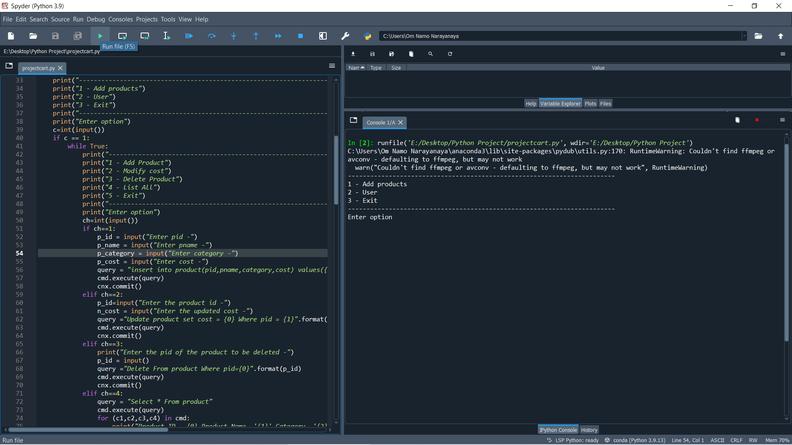
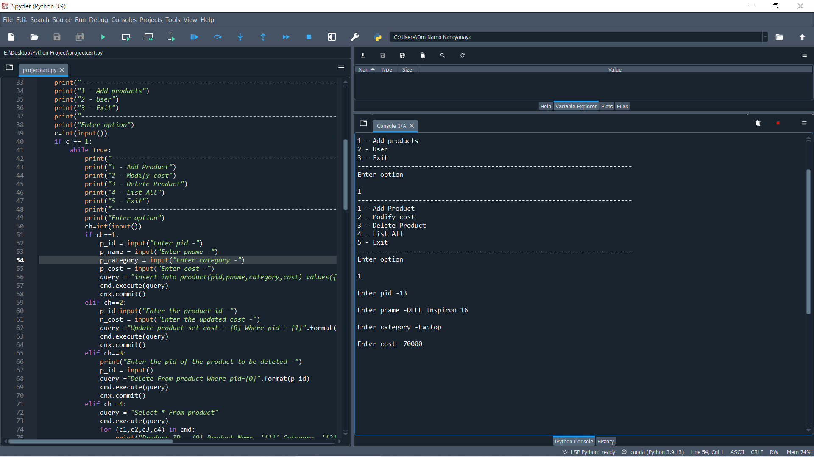
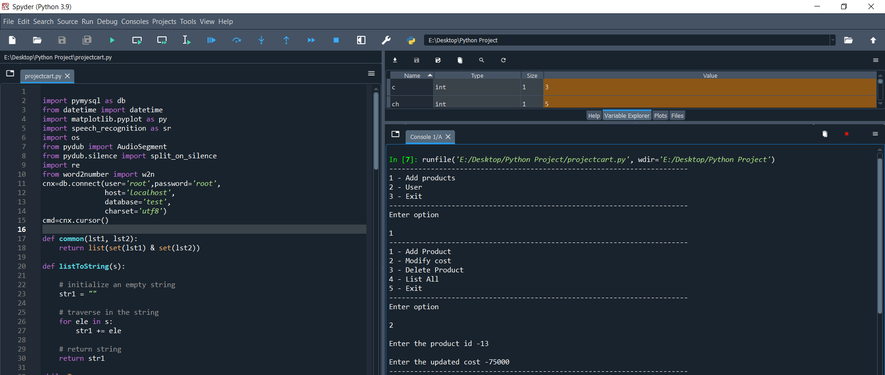

# Python-Shopping-Cart
A simple console based shopping cart implemented using python and MySql.
 
<h2>Project Description</h2>
This consists of 2 options one for the admin and one for the user.
 

 
The admin can add items,modify the cost, delete and product and list all the products which is stored in the database.
 
All the details of the prducts are stored in the table product in the database test. 
<ul>
  <li>Add Products
     
    
     
    Contents In the table product and adding product.
     
    
     
  </li>
  <li>Modify Cost
     
    
     
    Contents In the table product and modifying the cost of the product.
     
    
     
  </li>
