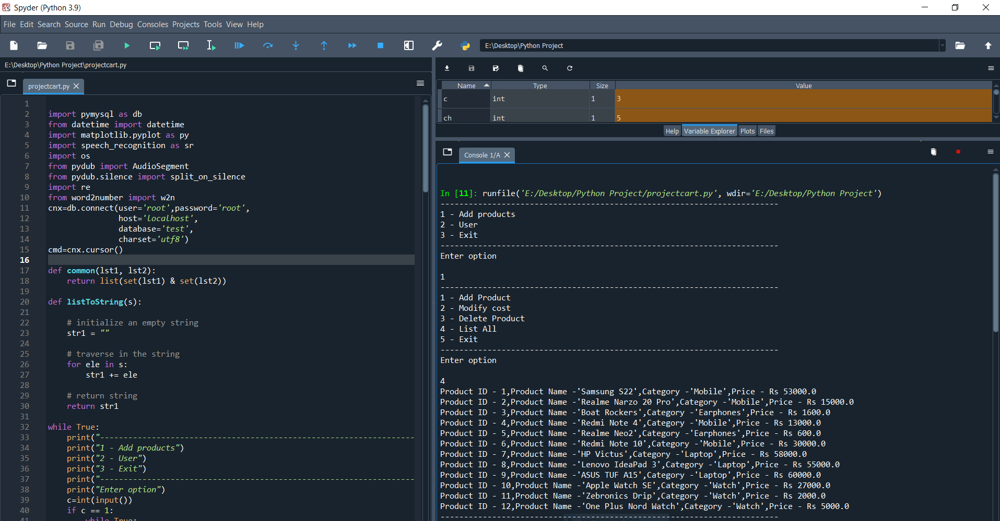
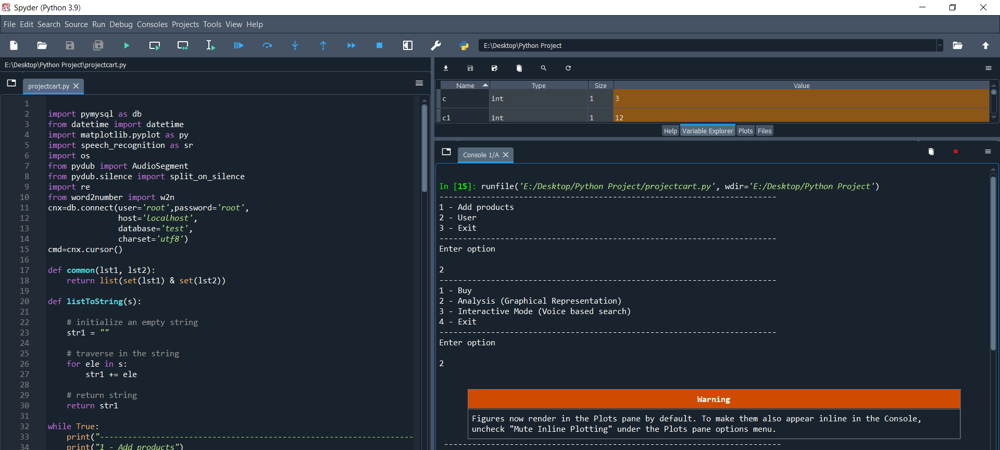
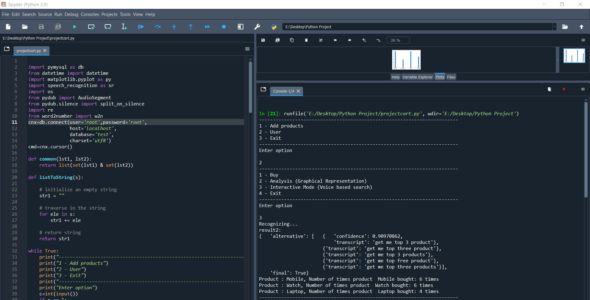

# Python-Shopping-Cart
A simple console based shopping cart implemented using python and MySql.
 
<h2>Project Description</h2>
This consists of 2 options one for the admin and one for the user.
 

 
<ul>
  <li><h3>Add Products:</h3>
    The admin can add items,modify the cost, delete and product and list all the products which is stored in the database.
 
All the details of the prducts are stored in the table product in the database test. 
<ul>
  <li><h3>Add Products</h3>
     
    
     
    Contents In the table product and adding product.
     
    
     
  </li>
  <li><h3>Modify Cost</h3>
     
    
     
    Contents In the table product after modifying the cost of the product.
     
    
     
  </li>
  <li><h3>Delete Product</h3>
     
    
     
    Contents In the table product after deleting a product.
     
    
     
  </li>
  <li><h3>List All of the products</h3>
     
    
     
  </li>
  </li>
   <li><h3>User:</h3>
     The user can buy, analyse,and search for top product based on speach recognition.
     <li><h3>Buy product</h3>
        
       All the products available are listed to the user and then the product which is bought by the user is stored in the table tracker with the date and time at which it was bought.
        
       
        
       Content in the table tracker after buying a product.
        
       
        
  </li>
  <li><h3>Analysis</h3>
    This gives us a plot of number of products brought from each category.
     
    
     
      <h4>Plot</h4>
     
    
     
  </li>
  <li><h3>Interactive Mode</h3>
    This queries the top products based on speech recognition.
     
    
     
  </li>
  </li>
 

